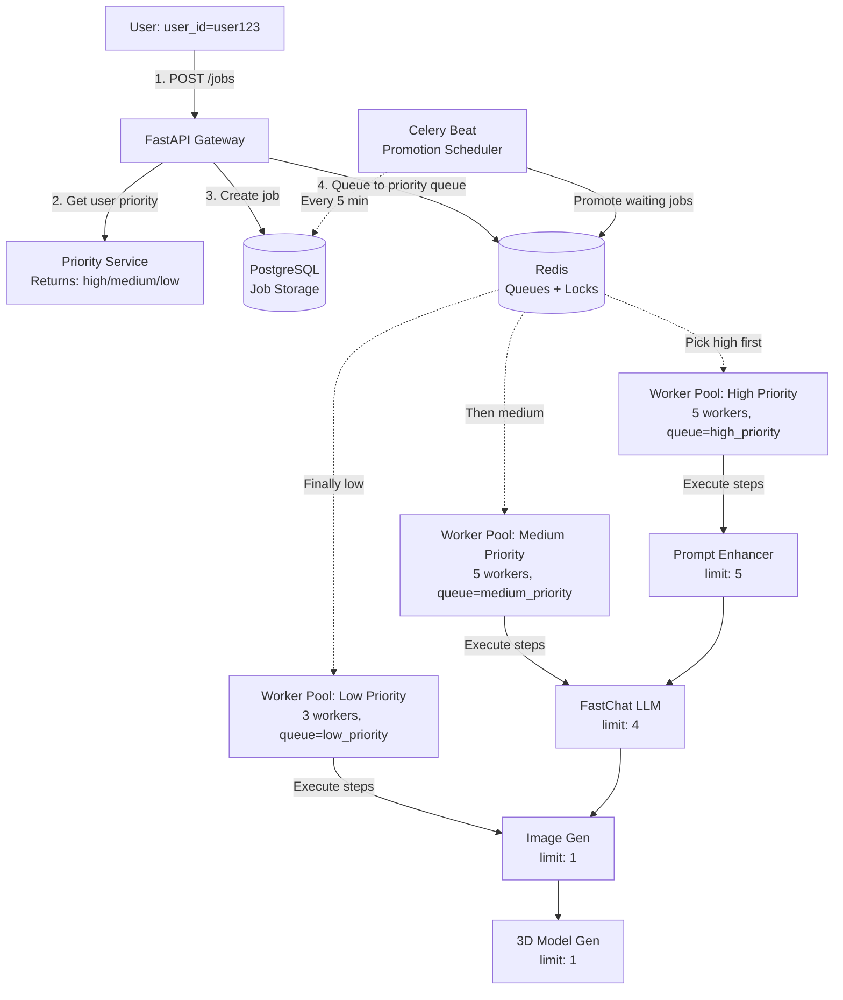

# CAO Gateway - Priority Queue System Guide

## 📚 Table of Contents

1. [System Overview](#system-overview)
2. [Architecture](#architecture)
3. [Core Components](#core-components)
4. [Complete Flow Examples](#complete-flow-examples)
5. [Concurrency Control Deep Dive](#concurrency-control-deep-dive)
6. [Priority & Promotion](#priority--promotion)
7. [Error Handling & Retries](#error-handling--retries)
8. [Troubleshooting Scenarios](#troubleshooting-scenarios)

---

## System Overview

### What Problem Does This Solve?

You have multiple AI endpoints with **different concurrency limits** and **varying response times**:

| AI Endpoint | Max Concurrent | Avg Response | Why Limited? |
|-------------|---------------|--------------|--------------|
| Prompt Enhancer | 5 | 1-2 min | CPU-intensive NLP |
| FastChat LLM | 4 | 2-3 min | GPU memory limited |
| Image Generation | 1 | 5-6 min | Heavy GPU processing |
| 3D Model Gen | 1 | 6-7 min | Extreme GPU + RAM usage |

**Without this system:**
- ❌ Premium users wait behind free users
- ❌ Endpoints get overloaded and crash
- ❌ Jobs fail due to concurrent request limits
- ❌ Free users starve when many premium users submit jobs

**With this system:**
- ✅ Premium users get priority execution
- ✅ Concurrency limits respected per endpoint
- ✅ Free users eventually get served (time-based promotion)
- ✅ Efficient resource utilization

---

## Architecture

### High-Level System Diagram



### Request Flow

```
┌─────────────────────────────────────────────────────────────────┐
│ 1. JOB CREATION                                                 │
└─────────────────────────────────────────────────────────────────┘
Frontend → POST /api/v1/jobs
  {
    "user_id": "user123",
    "feature_name": "full_pipeline",
    "input_data": {"prompt": "A futuristic city"}
  }
    ↓
API Gateway:
  - Call Priority Service → Get "high" for user123
  - Create Job in DB with priority="high"
  - Queue to "high_priority" queue
    ↓
Response:
  {
    "job_id": "abc-123",
    "priority": "high",
    "status": "PENDING"
  }

┌─────────────────────────────────────────────────────────────────┐
│ 2. JOB EXECUTION (Multi-Step Pipeline)                         │
└─────────────────────────────────────────────────────────────────┘
Worker (from high_priority queue) picks up job
    ↓
execute_job_step(job_id="abc-123")
    ↓
Orchestrator.execute_one_step():
  - Load job from DB
  - Check: step_index=0 → Service="prompt_enhancer"
  - Acquire concurrency slot (limit: 5)
  - Call prompt_enhancer API
  - Save result to job.context
  - Increment step_index to 1
  - Queue next step → high_priority queue
    ↓
execute_job_step(job_id="abc-123") [2nd call]
    ↓
Orchestrator.execute_one_step():
  - Check: step_index=1 → Service="fast_chat_llm"
  - Acquire slot (limit: 4)
  - Call fast_chat_llm API (uses prompt_enhancer output)
  - Save result
  - Increment step_index to 2
  - Queue next step → high_priority queue
    ↓
... (continues for image_gen and model_3d_gen)
    ↓
Final step completes → Mark job as COMPLETED

┌─────────────────────────────────────────────────────────────────┐
│ 3. PRIORITY PROMOTION (Background)                             │
└─────────────────────────────────────────────────────────────────┘
Celery Beat (every 5 minutes):
    ↓
promote_waiting_jobs():
  - Query DB: Jobs waiting > 30 min with priority="low"
  - Promote to "medium"
  - Query DB: Jobs waiting > 60 min with priority="medium"
  - Promote to "high"
  - Re-queue to new priority queue
  - Send WebSocket notification
```

---

## Core Components

### 1. Job Model (`app/models/job.py`)

**Purpose:** Database representation of a job

```python
class Job(SQLModel, table=True):
    # Core fields
    id: str                          # "abc-123"
    feature_name: str                # "full_pipeline"
    status: JobStatus                # PENDING, RUNNING, COMPLETED, FAILED
    current_step_index: int          # 0, 1, 2, 3... (which step we're on)
    context: Dict                    # Stores results from each step
    
    # Priority fields
    priority: str                    # "high", "medium", "low"
    user_id: str                     # "user123"
    queued_at: float                 # 1707999123.45 (timestamp)
    promoted_at: Optional[float]     # Timestamp of last promotion
    original_priority: str           # "low" (to prevent re-promotion)
```

**Example Job Lifecycle:**

```python
# Creation
{
  "id": "abc-123",
  "feature_name": "full_pipeline",
  "status": "PENDING",
  "current_step_index": 0,
  "priority": "high",
  "user_id": "user123",
  "queued_at": 1707999123.45,
  "context": {}
}

# After step 0 (prompt_enhancer)
{
  "current_step_index": 1,
  "status": "RUNNING",
  "context": {
    "step_0_prompt_enhancer": {
      "status": "SUCCESS",
      "data": {"enhanced_prompt": "..."},
      "metrics": {"execution_time_ms": 45000}
    }
  }
}

# After step 1 (fast_chat_llm)
{
  "current_step_index": 2,
  "context": {
    "step_0_prompt_enhancer": {...},
    "step_1_fast_chat_llm": {
      "status": "SUCCESS",
      "data": {"generated_text": "..."},
      "metrics": {"execution_time_ms": 120000}
    }
  }
}
```

---

### 2. Priority Service (`app/services/priority_service.py`)

**Purpose:** Fetch user's priority from external API

```python
class PriorityService:
    def get_user_priority(self, user_id: str) -> str:
        """
        Calls: GET http://priority-service:8000/users/{user_id}/priority
        
        Example Response:
        {
          "priority": "high"  # Based on subscription package
        }
        
        Returns: "high", "medium", or "low"
        Fallback: "medium" on error
        """
```

**Real-World Example:**

```python
# External API mapping (example)
Subscription Package → Priority
- Enterprise Plan     → "high"
- Pro Plan            → "medium"  
- Free Plan           → "low"

# API calls
priority_service.get_user_priority("user_enterprise_1") → "high"
priority_service.get_user_priority("user_pro_2")        → "medium"
priority_service.get_user_priority("user_free_3")       → "low"
```

---

### 3. Limiter Service (`app/services/limiter_service.py`)

**Purpose:** Distributed semaphore to control concurrency per AI endpoint

#### How It Works

**Concept:** Think of it as a **parking lot** with limited spaces:

```
Image Generation Endpoint (limit: 1)
┌──────────────────────────────────┐
│  Parking Lot (1 space total)    │
│  ┌────────────────────┐          │
│  │ [Worker A's car]   │  ← Occupied
│  └────────────────────┘          │
│                                  │
│  Worker B, C, D waiting...       │
└──────────────────────────────────┘
```

**Implementation with Redis:**

```python
def acquire(service_name, limit, lease_ttl, wait_timeout):
    """
    Try to get a parking space (concurrency slot)
    
    Args:
        service_name: "image_gen"
        limit: 1
        lease_ttl: 400 seconds
        wait_timeout: 360 seconds
    """
    
    # Redis keys
    counter_key = "conc:image_gen"      # Current parked cars: 0 or 1
    lease_key = "lease:image_gen:abc"   # Worker A's parking ticket
    
    # Lua script (runs atomically on Redis)
    lua = """
    local current = redis.call("GET", "conc:image_gen")  -- Check spaces
    if current >= 1 then
        return nil  -- Parking full, rejected
    end
    
    redis.call("INCR", "conc:image_gen")     -- Park car (0 → 1)
    redis.call("SET", "lease:image_gen:abc", "1", "EX", 400)  -- Ticket expires in 400s
    return "lease:image_gen:abc"  -- Success!
    """
```

**Timeline Example:**

```
Time    Action                                  Redis State
─────────────────────────────────────────────────────────────
00:00   Worker A: acquire("image_gen")
        Redis: conc:image_gen = 0 < 1 ✓
        Redis: INCR conc:image_gen → 1         conc:image_gen = 1
        Redis: SET lease:image_gen:token1      lease:image_gen:token1 = 1
        Return: "lease:image_gen:token1" ✅

00:01   Worker B: acquire("image_gen")
        Redis: conc:image_gen = 1 >= 1 ❌
        Return: nil
        Action: Sleep 0.5s, retry...           conc:image_gen = 1

00:02   Worker B: retry acquire()
        Redis: conc:image_gen = 1 >= 1 ❌
        Return: nil
        Action: Sleep 0.5s, retry...           conc:image_gen = 1

05:00   Worker A: Completes AI call
        Worker A: release(token1)
        Redis: DEL lease:image_gen:token1
        Redis: DECR conc:image_gen → 0         conc:image_gen = 0

05:01   Worker B: retry acquire()
        Redis: conc:image_gen = 0 < 1 ✓
        Redis: INCR conc:image_gen → 1         conc:image_gen = 1
        Return: "lease:image_gen:token2" ✅
```

**Crash Safety:**

```
Time    Action                                  Redis State
─────────────────────────────────────────────────────────────
00:00   Worker A: acquire() → Success          conc:image_gen = 1
                                                lease:...:token1 TTL=400s

02:00   Worker A: CRASHES! 💥                  conc:image_gen = 1
        (Never calls release())                 lease:...:token1 TTL=280s

06:40   Redis: TTL expires on lease                           
        (Auto-cleanup)                          lease deleted
                                                conc:image_gen = 1 (stale!)

07:00   Background task: reap_expired_leases()
        Checks leases, recomputes counters     conc:image_gen = 0 ✓

07:01   Worker B: acquire() → Success!         conc:image_gen = 1
```

---

### 4. Orchestrator Service (`app/services/orchestrator_service.py`)

**Purpose:** Execute one step of a multi-step pipeline

#### Detailed Step Execution

```python
def execute_one_step(job_id: str) -> str:
    """
    Execute current step for a job
    
    Returns:
    - "OK"                  → Step succeeded, continue to next
    - "SKIPPED_ALREADY_DONE" → Step already completed (idempotency)
    - "DONE"                → All steps complete
    - "FAILED"              → Step failed
    """
```

**Complete Flow Example:**

```
Job: "full_pipeline" = ["prompt_enhancer", "fast_chat_llm", "image_gen", "model_3d_gen"]
Current: step_index = 0

┌─────────────────────────────────────────────────────────────────┐
│ STEP 1: Validation                                              │
└─────────────────────────────────────────────────────────────────┘
✓ Job exists
✓ Not cancelled/completed
✓ Feature "full_pipeline" exists
✓ step_index (0) < total_steps (4)

┌─────────────────────────────────────────────────────────────────┐
│ STEP 2: Idempotency Check                                      │
└─────────────────────────────────────────────────────────────────┘
Check: job.context["step_0_prompt_enhancer"] exists?
→ No → Continue

┌─────────────────────────────────────────────────────────────────┐
│ STEP 3: Retry Check                                            │
└─────────────────────────────────────────────────────────────────┘
attempts = job.context["step_0_prompt_enhancer__attempts"] = 0
max_attempts = 3
→ 0 < 3 ✓ Continue

┌─────────────────────────────────────────────────────────────────┐
│ STEP 4: Acquire Concurrency Slot                               │
└─────────────────────────────────────────────────────────────────┘
WebSocket → "WAITING for prompt_enhancer capacity..."

lease = limiter.acquire(
    service_name="prompt_enhancer",
    limit=5,
    lease_ttl=150,
    wait_timeout=120
)

If lease = None:
  → Mark job FAILED with "RESOURCE_EXHAUSTED"
  → WebSocket → "Service busy. Resume available."
  → Return "FAILED"

If lease = "lease:prompt_enhancer:xyz":
  → Continue ✓

┌─────────────────────────────────────────────────────────────────┐
│ STEP 5: Execute AI Service Call                                │
└─────────────────────────────────────────────────────────────────┘
job.context["step_0_prompt_enhancer__attempts"] = 1
job.status = "RUNNING"

WebSocket → "STEP_START: Running prompt_enhancer (1/4)"

Request to http://prompt-enhancer:9000/v1/execute:
{
  "meta": {
    "job_id": "abc-123",
    "step_index": 0,
    "service_name": "prompt_enhancer",
    "attempt": 1
  },
  "payload": {
    "params": {"prompt": "A futuristic city"},
    "context": {}
  }
}

Response (after 45 seconds):
{
  "data": {
    "enhanced_prompt": "A photorealistic futuristic city with neon lights..."
  },
  "metrics": {
    "model_version": "v2.1",
    "processing_time_ms": 44800
  }
}

┌─────────────────────────────────────────────────────────────────┐
│ STEP 6: Save Result                                            │
└─────────────────────────────────────────────────────────────────┘
job.context["step_0_prompt_enhancer"] = {
  "status": "SUCCESS",
  "data": {"enhanced_prompt": "A photorealistic..."},
  "metrics": {"execution_time_ms": 45000}
}

job.current_step_index = 1  (0 → 1)
job.last_progress_at = now()

WebSocket → "STEP_COMPLETE: Completed prompt_enhancer (1/4)"

┌─────────────────────────────────────────────────────────────────┐
│ STEP 7: Release Slot & Return                                  │
└─────────────────────────────────────────────────────────────────┘
limiter.release("prompt_enhancer", "lease:prompt_enhancer:xyz")
→ Slot freed for next worker

Return "OK"
```

**Worker then queues next step:**

```python
# In worker/tasks.py
if result == "OK":
    # Queue next step to same priority queue
    execute_job_step.apply_async(
        args=["abc-123"],
        queue="high_priority"  # Same as job.priority
    )
```

---

## Complete Flow Examples

### Example 1: High Priority User - Full Pipeline

**Scenario:** Enterprise user submits a job for full AI pipeline

```
User: John (Enterprise Plan)
Feature: full_pipeline
Input: {"prompt": "Design a robot"}
```

#### Timeline

```
T+0s    │ POST /api/v1/jobs
        │ ├─ Priority API → "high" (Enterprise plan)
        │ ├─ Create Job: priority="high", queued_at=T+0
        │ └─ Queue → high_priority
        │
T+1s    │ worker_high picks up job
        │ └─ execute_job_step("job-123")
        │
T+2s    │ Orchestrator: Step 0 (prompt_enhancer)
        │ ├─ Acquire slot: conc:prompt_enhancer (1/5) ✓
        │ ├─ Call API → 45s
        │ └─ Save: {"enhanced_prompt": "..."}
        │
T+47s   │ Step 0 complete
        │ ├─ Release slot: conc:prompt_enhancer (0/5)
        │ ├─ Increment step_index: 0 → 1
        │ └─ Queue next → high_priority
        │
T+48s   │ worker_high picks up job again
        │ └─ execute_job_step("job-123")
        │
T+49s   │ Orchestrator: Step 1 (fast_chat_llm)
        │ ├─ Acquire slot: conc:fast_chat_llm (1/4) ✓
        │ ├─ Call API (uses enhanced_prompt) → 120s
        │ └─ Save: {"generated_text": "..."}
        │
T+169s  │ Step 1 complete
        │ ├─ Release slot: conc:fast_chat_llm (0/4)
        │ ├─ Increment step_index: 1 → 2
        │ └─ Queue next → high_priority
        │
T+170s  │ Orchestrator: Step 2 (image_gen)
        │ ├─ Acquire slot: conc:image_gen (0/1) → WAIT
        │ │   (Another high-priority job using it)
        │ ├─ Wait... retry every 0.5s
        │
T+240s  │ Slot available!
        │ ├─ Acquire slot: conc:image_gen (1/1) ✓
        │ ├─ Call API → 300s
        │ └─ Save: {"image_url": "..."}
        │
T+540s  │ Step 2 complete
        │ ├─ Release slot: conc:image_gen (0/1)
        │ ├─ Increment step_index: 2 → 3
        │ └─ Queue next → high_priority
        │
T+541s  │ Orchestrator: Step 3 (model_3d_gen)
        │ ├─ Acquire slot: conc:model_3d_gen (1/1) ✓
        │ ├─ Call API → 350s
        │ └─ Save: {"model_url": "..."}
        │
T+891s  │ Step 3 complete (final step)
        │ ├─ Release slot: conc:model_3d_gen (0/1)
        │ ├─ step_index: 3 → 4
        │ ├─ 4 >= 4 (total_steps)
        │ └─ Mark job COMPLETED ✓
        │
        │ WebSocket → "JOB_COMPLETE"
        │ Total time: ~15 minutes
```

---

### Example 2: Low Priority User with Promotion

**Scenario:** Free user submits job, gets promoted after waiting

```
User: Alice (Free Plan)
Feature: text_only
Input: {"prompt": "Write a story"}
```

#### Timeline

```
T+0m    │ POST /api/v1/jobs
        │ ├─ Priority API → "low" (Free plan)
        │ ├─ Create Job: priority="low", original_priority="low"
        │ └─ Queue → low_priority
        │
T+1m    │ worker_low tries to pick up job
        │ ├─ Orchestrator: Step 0 (prompt_enhancer)
        │ └─ Acquire slot: ALL BUSY (high/medium jobs using all 5)
        │     → RESOURCE_EXHAUSTED → Job marked FAILED (retryable)
        │
T+2m    │ Auto-resume (Celery retry)
        │ └─ Queue → low_priority
        │
...     │ (Still blocked by higher priority jobs)
        │
T+30m   │ Promotion Task runs (every 5 min)
        │ ├─ Query: Jobs with priority="low" AND queued_at < now-1800s
        │ ├─ Found: Alice's job (queued 30 min ago)
        │ ├─ Promote: priority "low" → "medium"
        │ ├─ Set: promoted_at = now()
        │ ├─ Re-queue → medium_priority
        │ └─ WebSocket → "JOB_PROMOTED: low → medium"
        │
T+31m   │ worker_medium picks up job
        │ └─ Orchestrator: Step 0 (prompt_enhancer)
        │ ├─ Acquire slot: Got it! (medium has priority over low)
        │ ├─ Call API → 50s
        │ └─ Save result
        │
T+32m   │ Step 0 complete → Queue step 1
        │
T+33m   │ Orchestrator: Step 1 (fast_chat_llm)
        │ ├─ Acquire slot ✓
        │ ├─ Call API → 110s
        │ └─ Save result
        │
T+35m   │ Step 1 complete (final step)
        │ └─ Mark job COMPLETED ✓
        │
        │ Total time: ~35 minutes (30 min waiting + 5 min execution)
```

---

## Concurrency Control Deep Dive

### Scenario: 10 Workers, 1 Endpoint (limit: 1)

```
Workers: A, B, C, D, E, F, G, H, I, J
Endpoint: image_gen (limit: 1)
All try to acquire at T+0
```

**Execution:**

```
T+0s    Redis State: conc:image_gen = 0
        
        Worker A: eval(lua) → cur=0 < 1 ✓
        ├─ INCR conc:image_gen → 1
        ├─ SET lease:image_gen:A with TTL=400s
        └─ Return success ✅
        
        Workers B-J: eval(lua) → cur=1 >= 1 ❌
        └─ Sleep 0.5s, will retry

T+0.5s  Workers B-J: Retry acquire()
        Redis: conc:image_gen = 1 ❌
        └─ Sleep 0.5s, retry again

T+300s  Worker A: Completes AI call
        Worker A: release()
        ├─ DEL lease:image_gen:A
        ├─ DECR conc:image_gen → 0
        └─ Slot freed!

T+300.5s One of B-J: acquire() → Success ✓
        Others: Continue waiting...
```

**Why Lua is Critical:**

Without Lua (race condition):

```
Worker A: GET conc:image_gen → 0
Worker B: GET conc:image_gen → 0  (same time!)

Worker A: INCR conc:image_gen → 1
Worker B: INCR conc:image_gen → 2  ❌ LIMIT EXCEEDED!
```

With Lua (atomic):

```
Redis executes entire script atomically:
- Worker A's script runs completely
- THEN Worker B's script runs
- No interleaving possible
```

---

## Priority & Promotion

### Queue Priority Behavior

**Celery Queue Selection:**

```
3 Worker Pools ═══════════════════════════════
║ worker_high   (5 workers) → high_priority  ║
║ worker_medium (5 workers) → medium_priority║
║ worker_low    (3 workers) → low_priority   ║
═══════════════════════════════════════════════

Each pool ONLY picks from its queue
Workers are isolated by priority
```

**Why This Design?**

```
Alternative (Single Queue with Priority):
  Problem: Low priority jobs could block high
  Problem: Complex Celery configuration
  
Our Design (3 Separate Queues):
  ✓ Simple: Each worker pool has dedicated queue
  ✓ Isolated: High priority never blocked by low
  ✓ Fair: Low priority still gets 3 workers
```

### Promotion Logic

```python
# Every 5 minutes, Celery Beat runs:

def promote_waiting_jobs():
    now = time.time()
    
    # Find jobs to promote
    jobs = db.query(
        Job.priority == "low" AND 
        Job.queued_at < now - 1800  # 30 minutes
    ) OR (
        Job.priority == "medium" AND
        Job.original_priority != "high" AND
        Job.queued_at < now - 3600  # 60 minutes
    )
    
    for job in jobs:
        if job.priority == "low":
            promote_to = "medium"
        elif job.priority == "medium":
            promote_to = "high"
        
        # Update job
        job.priority = promote_to
        job.promoted_at = now
        
        # Re-queue to new priority queue
        execute_job_step.apply_async(
            args=[job.id],
            queue=f"{promote_to}_priority"
        )
        
        # Notify user
        websocket.send({
            "type": "JOB_PROMOTED",
            "old": job.priority,
            "new": promote_to
        })
```

**Example Timeline:**

```
T+0m    Job created: priority="low"
        
T+5m    Promotion check: queued_at < now-30m? → No
T+10m   Promotion check: No
T+15m   Promotion check: No
T+20m   Promotion check: No
T+25m   Promotion check: No
T+30m   Promotion check: queued_at < now-30m? → YES!
        Promote: "low" → "medium"
        Re-queue to medium_priority
        
T+65m   Promotion check: queued_at < now-60m? → YES!
        Promote: "medium" → "high"
        Re-queue to high_priority
```

---

## Error Handling & Retries

### Retry Matrix

| Error Type | Retryable? | Action | Example |
|------------|-----------|--------|---------|
| Network timeout | ✅ Yes | Retry same step | Connection to AI service lost |
| Service 503 | ✅ Yes | Retry same step | AI service overloaded |
| Resource exhausted | ✅ Yes | Can resume | No concurrency slot available |
| Invalid input | ❌ No | Fail permanently | Malformed prompt data |
| Service 500 | ❌ No | Fail permanently | AI service internal error |
| Max attempts | ❌ No | Fail permanently | Step failed 3 times |

### Example: Transient Failure Recovery

```
T+0s    Step 1: Call fast_chat_llm
        Request sent...

T+30s   Network timeout! (Router glitch)
        ├─ ServiceCallError raised
        ├─ Mark job FAILED (retryable=True)
        └─ WebSocket → "Service timeout. Resume available."

T+31s   User: POST /jobs/{id}/resume
        ├─ Clear failure status
        ├─ Queue to job's current priority queue
        └─ Retry step 1

T+32s   Step 1: Call fast_chat_llm (attempt 2)
        ├─ Success! ✅
        └─ Continue to next step
```

### Example: Permanent Failure

```
T+0s    Step 0: Call prompt_enhancer
        Attempt 1: Network timeout ❌
        
T+5m    Retry: Attempt 2: Service 503 ❌
        
T+10m   Retry: Attempt 3: Service 500 ❌
        
        Attempts (3) >= max_step_attempts (3)
        ├─ Mark job FAILED (retryable=False)
        └─ WebSocket → "Max attempts exceeded. Contact support."
        
        Job cannot be resumed
```

---

## Troubleshooting Scenarios

### Scenario 1: Jobs Stuck in PENDING

**Symptoms:**
- Jobs queued but never execute
- worker logs show no activity

**Diagnosis:**

```bash
# Check worker status
docker compose logs worker_high worker_medium worker_low

# Check Redis queues
docker compose exec redis redis-cli
> LLEN high_priority
> LLEN medium_priority
> LLEN low_priority

# Check if tasks are reaching workers
# Look for: "Received task: execute_job_step"
```

**Common Causes:**

1. **Workers not running**
   ```bash
   docker compose ps
   # If workers not up:
   docker compose up -d worker_high worker_medium worker_low
   ```

2. **Wrong queue routing**
   ```python
   # Check job.priority matches queue
   # Job priority="high" but queued to "medium_priority" ❌
   ```

3. **Celery beat not running**
   ```bash
   docker compose logs beat
   # Should see: "beat: beat: Starting..."
   ```

---

### Scenario 2: Concurrency Limit Not Respected

**Symptoms:**
- More than `limit` concurrent calls to AI service
- AI service crashes or returns errors

**Diagnosis:**

```bash
# Check Redis counters
docker compose exec redis redis-cli
> GET conc:image_gen
> KEYS lease:image_gen:*

# Should be: counter <= limit
# Should be: number of leases == counter
```

**Common Causes:**

1. **Lease reaping not working**
   ```bash
   # Check background task
   docker compose logs beat | grep reap_expired_leases
   
   # Manual cleanup
   docker compose exec api python -c "
   from worker.tasks import reap_expired_leases
   reap_expired_leases()
   "
   ```

2. **Multiple Redis instances**
   ```bash
   # Ensure all workers use same Redis
   docker compose exec worker_high env | grep REDIS_URL
   docker compose exec worker_medium env | grep REDIS_URL
   # Should all point to redis:6379
   ```

---

### Scenario 3: Low Priority Jobs Never Execute

**Symptoms:**
- Free users' jobs stuck forever
- Promotion not working

**Diagnosis:**

```bash
# Check promotion task
docker compose logs beat | grep promote_waiting_jobs

# Check job in database
docker compose exec api python -c "
from app.db import SessionLocal
from app.repositories.job_repository import JobRepository

with SessionLocal() as session:
    repo = JobRepository(session)
    job = repo.get('job-id')
    print(f'Priority: {job.priority}')
    print(f'Queued at: {job.queued_at}')
    print(f'Original: {job.original_priority}')
"
```

**Common Causes:**

1. **Celery beat schedule not running**
   ```bash
   # Restart beat
   docker compose restart beat
   ```

2. **Thresholds too long**
   ```python
   # Check config
   PROMOTE_LOW_TO_MEDIUM_AFTER = 1800   # 30 min
   PROMOTE_MEDIUM_TO_HIGH_AFTER = 3600  # 60 min
   
   # For testing, reduce to 60s and 120s
   ```

3. **Worker pools starved**
   ```bash
   # Check if low priority workers exist
   docker compose ps worker_low
   
   # Check logs
   docker compose logs worker_low
   ```

---

### Scenario 4: WebSocket Not Receiving Updates

**Symptoms:**
- Frontend not showing job progress
- No real-time updates

**Diagnosis:**

```bash
# Check WebSocket connection
# In browser console:
ws = new WebSocket('ws://localhost:8000/ws/job-123')
ws.onmessage = (e) => console.log(e.data)

# Check Redis pub/sub
docker compose exec redis redis-cli
> PUBSUB CHANNELS
# Should see: ws:job-123

# Test publish
> PUBLISH ws:job-123 '{"type":"TEST"}'
# Should receive in browser
```

---

## Quick Reference

### Key Redis Keys

```
conc:{service}                    → Current concurrent count
lease:{service}:{token}           → Individual worker lease (TTL)
celery:{queue}                    → Celery task queue
```

### Environment Variables

```bash
PRIORITY_API_URL                  → External priority service
PROMOTE_LOW_TO_MEDIUM_AFTER       → Seconds (default: 1800)
PROMOTE_MEDIUM_TO_HIGH_AFTER      → Seconds (default: 3600)
REDIS_URL                         → Redis connection
DATABASE_URL                      → PostgreSQL connection
```

### Monitoring Commands

```bash
# Check queue lengths
redis-cli LLEN high_priority
redis-cli LLEN medium_priority
redis-cli LLEN low_priority

# Check concurrency
redis-cli GET conc:prompt_enhancer
redis-cli GET conc:fast_chat_llm
redis-cli GET conc:image_gen

# Check active leases
redis-cli KEYS "lease:*"

# Worker logs
docker compose logs -f worker_high
docker compose logs -f worker_medium
docker compose logs -f worker_low
```

---

## Summary

This system provides:

✅ **Priority-based execution** via 3 separate queues  
✅ **Concurrency control** using Redis-based distributed semaphores  
✅ **Fair scheduling** with time-based promotion  
✅ **Fault tolerance** through lease TTL and automatic retry  
✅ **Real-time updates** via WebSocket  

The architecture scales horizontally by adding more workers to each priority pool while maintaining strict concurrency limits per AI endpoint.
